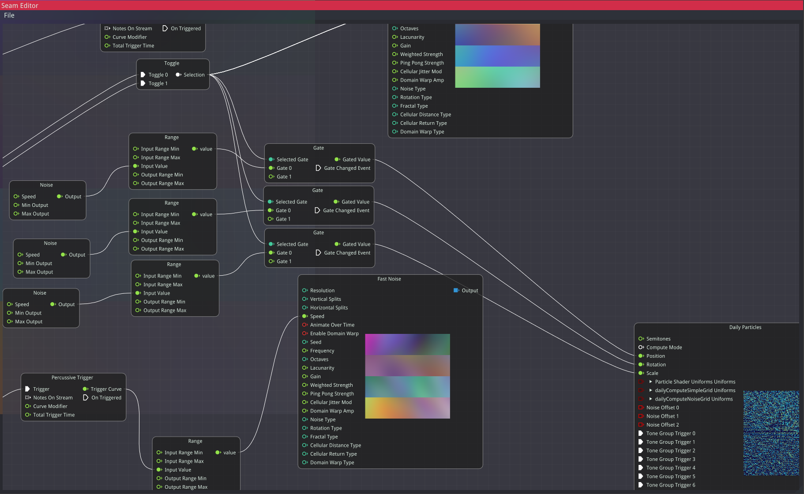

# ofxSeam

Seam is a GUI-based node graph editor [addon](https://openframeworks.cc/learning/01_basics/how_to_add_addon_to_project/) for [OpenFrameworks](https://openframeworks.cc/) 0.12+, designed for protoyping and building data-driven visual systems.

Seam uses C++17 so OpenFrameworks 0.12 is recommended, although it can be used with OF 0.11 if you are able to build with C++17 support. Windows Visual Studio and msys2 library dependencies are pre-built; if you are using Linux or Mac, dependencies will need to be built (see the dependencies section).

See the `example_usage` directory for a skeleton app you can use to get started using Seam. The Seam Editor hooks into OpenFrameworks' `update()`, `draw()`, etc. functions in your `ofApp`.

Seam is currently missing many quality of life features and has some annoying bugs. Node creation and connections are functional and node graph files can be saved and loaded, but don't expect a friendly experience _yet_. See the Known Issues section for more info.

Seam's design goals include:
- make audio-reactive visual systems easier to build and iterate.
- extensible node-and-pin based node graph editor that lets you easily create and add your own Node logic.
- non-invasive integration with existing data layout; Seam's `PinInput` class takes pointers to your data and accounts for stride and offset so you don't have to rearrange your data.
- quick and swappable integration of external signals (pipes, MIDI and OSC input, audio analysis) into visual systems.
- the ability to construct multi-pass render systems with an easy-to-use interface, while still retaining easy access to lower-level OpenGL calls.

The core of Seam is open source because Seam is built using many open source libraries, including:
- [ofxImGuiNodeEditor](https://github.com/austin-clifton/ofxImGuiNodeEditor), which itself is a mashup of [the original ImGui extension addon for OpenFrameworks](https://github.com/jvcleave/ofxImGui) and the [ImGui Node Editor extension](https://github.com/thedmd/imgui-node-editor).
- [Cap'n Proto](https://capnproto.org/) for file serialization (and likely over-the-wire serialization in the future).
- [ofxMidi](https://github.com/danomatika/ofxMidi) for handling MIDI input using Seam nodes.
- [ofxAudioAnalyzer](https://github.com/leozimmerman/ofxAudioAnalyzer) and [libEssentia](https://github.com/MTG/essentia) for the `AudioAnalyzer` Node.
- [FastNoiseLite](https://github.com/Auburn/FastNoiseLite) for the `FastNoise` Node.
- ...and more, this list will continue growing as more open source libraries are added.

License
-------

Seam's core Node Editor addon for OpenFrameworks is distributed under the [MIT License](https://en.wikipedia.org/wiki/MIT_License).

Installation
------------

If installing for MacOS or Linux, you will need to build additional dependencies yourself (listed below).

Dependencies
------------

Required dependencies are:
- [capnp and kj](https://capnproto.org/) (they are built together)
- [nativefiledialog](https://github.com/mlabbe/nativefiledialog)

These are already compiled for Windows, if you are using Linux or Mac OS you will need to compile them yourself. Please PR your additions!

Optional dependencies are:
- [libessentia](https://github.com/MTG/essentia) for audio analysis. Define the macro `BUILD_AUDIO_ANALYSIS` to build Seam with this dependency and add the Audio Analyzer node to your list of available Nodes.

I have compiled libessentia for msys2 but can't upload it here because the libraries are too large. If you need a copy of the library, please ask!

Compatibility
------------
Seam has been built and run using UCRT64 msys2 and Visual Studio 2019 using OpenFrameworks 0.12. It _should_ work fine on other platforms, but has not been tested, and dependencies will need to be built (see above).

Known issues
------------
- Pin connections occasionally deserialize to the wrong pins, usually only on one end.
- Some connections don't push data as expected until they are connected to something visual. Ideally, the system should push updates to any Node the user is currently viewing in the GUI.
- Pin connections probably need to be re-worked so that a range of elements can be pushed. `PinInput` will need to support multiple connections.
- Enabling audio analysis causes seg faults on app exit, still looking into why.
- Texture locations aren't currently managed in any helpful way. Seam should manage bound texture locations across Nodes for you.

Version history
------------

### Version 0.02 (7 Jan 2024):

- Nodes can be deleted now.
- Nodes are now sorted alphabetically in the GUI.
- The last loaded file is saved and pre-loaded through a `seamConfig.ini` file now. This file is written to the current working directory on exit.
- Introduced a getter-setter based Properties system for Nodes which have user-set values that shouldn't be treated like Pins. Properties are deserialized before Pins, and should be preferred when the value affects the number of Pins the Node exposes.
- [Split out the Editor's GUI drawing bits from the node graph management logic.](https://github.com/austin-clifton/ofxSeam/commit/6f2bdbdc2356cc1cb6fe9fe5d22d4982bda6b00a)
- Added Nodes:
    - Toggle lets you set up some number of states that can be swapped between; useful with the Gate node for setting up the beginnings of a state machine.
    - HDR Tonemapper accepts a floating point FBO, runs tonemapping and bloom on it, and outputs an LDR tonemapped FBO.
    - Fast Noise node is an integration of [the GLSL version](https://github.com/Auburn/FastNoiseLite/tree/master/GLSL) of [FastNoiseLite](https://github.com/Auburn/FastNoiseLite).
    - Optional Audio Analyzer Node, which is an integration of `ofxAudioAnalyzer`. Audio analysis can be enabled by defining the macro `BUILD_AUDIO_ANALYSIS`.
- Pin system changes:
    - Add `PinType::ANY` for Nodes that want to accept any type as an input.
    - Add support for Pin hierarchies. Pins can now have children, which are displayed in a dropdown in the editor GUI.
    - Add support for stride, offset, and numCoords in `PinInput` so GPU-mapped data is easier to configure using the editor GUI.
    - Differing Pin types will now connect as long as a reasonable and expected conversion exists. For instance, in a float --> int connection the receiving end will be set to the floored input value.

### Version 0.01 (5 Sep 2023):
Initial commit after moving from the original repo; moved Seam code to an ofx addon.